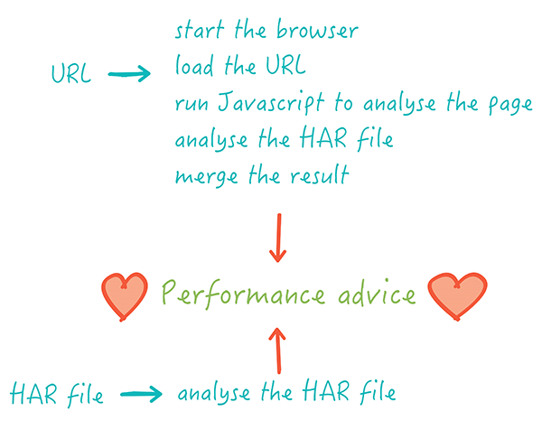

# The coach

[![Build status][travis-image]][travis-url]
[![Stars][stars-image]][stars-url]

[Documentation](https://www.sitespeed.io/documentation/coach/) | [Changelog](https://github.com/sitespeedio/coach/blob/master/CHANGELOG.md)


The coach helps you find performance problems on your web page. You can think of the coach as a modern version of [YSlow](http://yslow.org/).

- [Does my page need coaching?](#do-my-page-need-coaching)
- [Why we love the coach](#why-we-love-the-coach)
- [Work in progress](#work-in-progress)
- [How to use the coach](#how-to-use-the-coach)
  - [Standalone](#standalone)
  - [Bookmarklet](#bookmarklet)
  - [Include in your own tool](#include-in-your-own-tool)
- [What does the coach do?](#what-do-the-coach-do)
- [How does it all work](#how-does-it-all-work?)
  - [Bonus](#bonus)
  - [Best practice](#best-practice)
  - [Privacy](#privacy)
  - [General information](#general-information)
  - [Timings](#timings)
- [Developers guide](#developers-guide)
- [Browser support](#browser-support)

## Does my page need coaching?

You know, it's hard to get everything right! Some of the previous performance best practices are now worst practices. The coach will detect that the page is accessed using HTTP/2, and adjust its advice accordingly.


## Why we love the coach

Ten reasons why we love the coach:
- The coach gives you advice on how to make your page faster. The coach aims to NEVER give you bad advice. Follow the advice and you will WIN!
- The coach uses real browsers to see your page exactly like your users do.
- Every advice has one or more unit-tests to make sure it's easy to change advice in the future.
- The coach knows about more than just performance: Accessibility and web best practice are other things that the coach can help you with.
- You can [integrate the coach](https://github.com/sitespeedio/coach-core) with your own web performance tool. It's easy: your tool only need to be able to run JavaScript in the browser and produce a HAR file. Or you can use the built-in functionality of the coach to run the browser.
- The coach is open-source. The advice is public, you can check it and change it yourself. Help us make the coach even better!
- The coach can combine knowledge from the DOM with HAR to give you super powerful advice.
- The CLI output is pretty nice. You can configure how much you want to see. Use it as fast way to check the performance of your page.

## How to use the coach

You can use the coach in a few different ways.

### Docker

```bash
docker run sitespeedio/coach https://www.sitespeed.io
```

To build a docker image from source you will need to run one command

```bash
docker build -t my-custom-coach .
```

### Standalone

You need Node.js LTS (you need to be on 12 or later). And you need Chrome and/or Firefox installed.

If you want to use Chrome (Chrome is default):

```bash
webcoach https://www.sitespeed.io
```

Try it with Firefox (needs Firefox 57 or later):

```bash
npm install webcoach -g
webcoach https://www.sitespeed.io --browser firefox
```

If you also want to show the offending assets/details and the description of the advice:

```bash
webcoach https://www.sitespeed.io --details --description
```

By default, the coach only tells you about advice where you don't get the score 100. You can change that. If you want to see all advice, you can do that too:

```bash
webcoach https://www.sitespeed.io --limit 101
```

If you want to test as a mobile device, that's possible too, by faking the user-agent.

```bash
webcoach https://www.sitespeed.io --mobile -b chrome
```

> ... but hey, I want to see the full JSON?

Yes, you can do that!

```bash
webcoach https://www.sitespeed.io -f json
```

This will get you the full JSON, the same as if you integrate the coach into your tool.

> ... but hey, I don't want any color in the table output?

That's possible as well!

```bash
webcoach https://www.sitespeed.io --noColor
```

### Include in your own tool

The coach uses Browsertime to start the browser, execute the JavaScript and fetch the HAR file. You can use that functionality too inside your tool or you can use the raw scripts if you have your own browser implementation. 

#### Use built in browser support

In the simplest version you use the default configuration (default DOM and HAR advice and using Firefox):

```js
const api = require('webcoach');
const result = api.run('https://www.sitespeed.io');
```

The full API method:

```js
// get the API
const api = require('webcoach');
const result = api.run(url, domScript, harScript, options);
```

#### Use the scripts
Checkout the [coach-core](https://github.com/sitespeedio/coach-core) module.

## What does the coach do

The coach will give you advice on how to do your page better. You will also get a score between 0-100. If you get 100 the page is great, if you get 0 you can do much better!

## How does it all work?

The coach tests your site in two steps:

* Executes JavaScript in your browser and check for performance, accessibility, best practice and collect general info about your page.
* Analyze the [HAR file](http://www.softwareishard.com/blog/har-12-spec/) for your page together with relevant info from the DOM process.

You can run the different steps standalone but for the best result run them together.



## Bonus

The coach knows more than just performance. She also knows about accessibility and web best practice.

### Accessibility

Make sure your site is accessible and usable for everyone. You can read more about making the web accessible [here](https://www.marcozehe.de/articles/2015-12-14-the-web-accessibility-basics/).

### Best practice

You want your page to follow best practices, right? Making sure your page is set up for search engines, have good URL structure and so on.

### Privay

Make sure that your page respect user privacy.

### General information

The world is complex. Some things are great to know but hard for the coach to give advice about.

The coach will then just tell you how the page is built and you can draw your own conclusions if something should be changed.

### Timings

The coach has a clock and knows how to use it! You will get timing metrics and know if you are doing better or worse than the last run.

## Developers guide

Checkout the [developers guide](docs/developers-guide.md) to get a better feeling how the coach works.

## Browser support

The coach is automatically tested in latest Chrome and Firefox. To get best results you need Chrome or Firefox 48 (or later) to be able to know if the server is using HTTP/2.

We hope that the coach works in other browsers but we cannot guarantee it right now.


[travis-image]: https://img.shields.io/travis/sitespeedio/coach/master.svg?style=flat-square
[travis-url]: https://travis-ci.org/sitespeedio/coach
[stars-url]: https://github.com/sitespeedio/coach/stargazers
[stars-image]: https://img.shields.io/github/stars/sitespeedio/coach.svg?style=flat-square
[downloads-image]: http://img.shields.io/npm/dm/webcoach.svg?style=flat-square
[downloads-url]: https://npmjs.org/package/webcoach
[docker-image]: https://img.shields.io/docker/pulls/sitespeedio/coach.svg
[docker-url]: https://hub.docker.com/r/sitespeedio/coach/
